
安装Visual GDB for visual studio 2019

---

# 下载安装Visual Studio 2019（如果已安装请跳过）

1. 进入[Visual Studio官方网站](https://visualstudio.microsoft.com/zh-hans/)进行下载，选择合适的安装路径(**路径中确保不能有中文**)

2. 安装Visual Studio 2019 Comunity版本()

3. 下载我们所需的C++组件

    

    等待安装成功。。。

# 下载安装VisualGDB

1. 关闭Visual Studio，双击运行VisualGDB-5.5r4.msi

    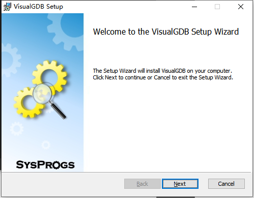

    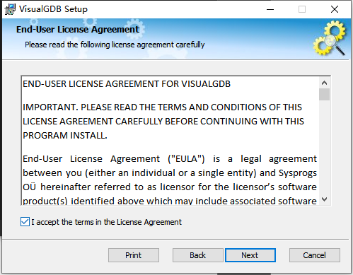

2. 直接选择Quick Installation，如果选择Common Installation也可，但需注意不要有中文路径

    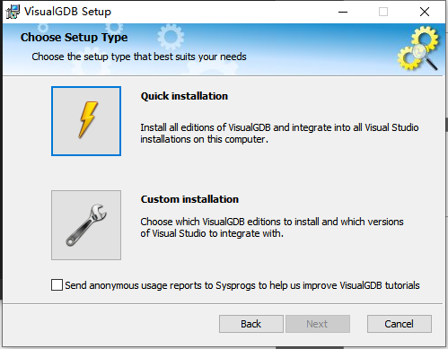

    

    

3. 安装结束后进入Visual Studio 2019，点击帮助中About VisualGDB，可以发现GDB已经破解成功（**注意千万不要更新，更新之后就无法破解，需要卸载GDB后重新安装**）

    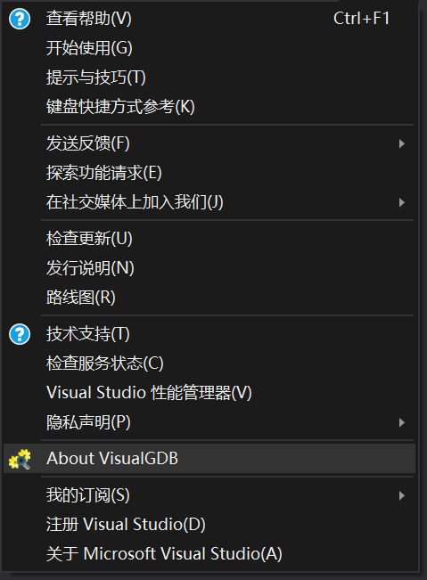

    

4. 首次启动时，请打开已有项目。如果需要重新创建新项目，需要指定工具链版本以及BSP（Board Support Package），实际上如果需要指定的版本当然可以，但为了兼容旧代码，这里直接打开已有项目，Visual GDB会自动下载配套的工具链：

    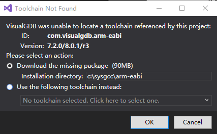

    点击OK开始下载

    

    上述下载可能比较慢，如有需要可以开启全局代理，这里不过多赘述。

    之后下载BSP，这也会自动匹配到stm32，版本为3.6。点击Download BSP即可

    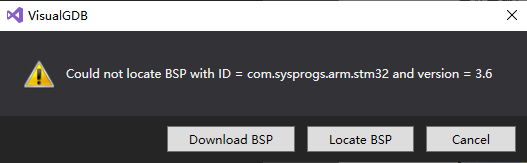

    重新生成MSBuild文件，点击Yes即可

    

    此时即可查看该工程，按Ctrl+Shift+B启动Build，稍等后显示项目生成成功即可。

    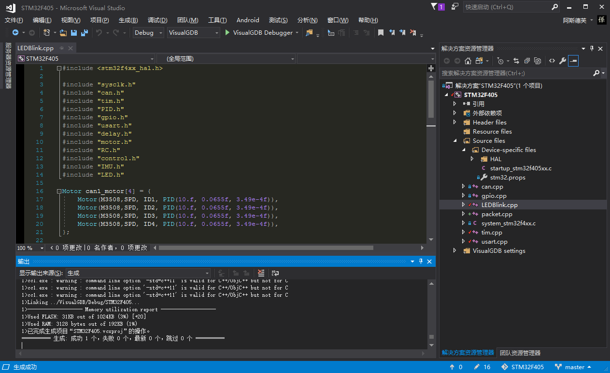

    输出中也许会有红色的warning，不用理会。只要能生成成功就行。也可能会提示一些文件缺失，有可能是项目文件本身的问题

5. 配置调试器，在解决方案资源管理器中，右键点击项目名，选择VisualGDB Project Properties.

    

    查看Debug settings，选择OpenOCD并下载。

    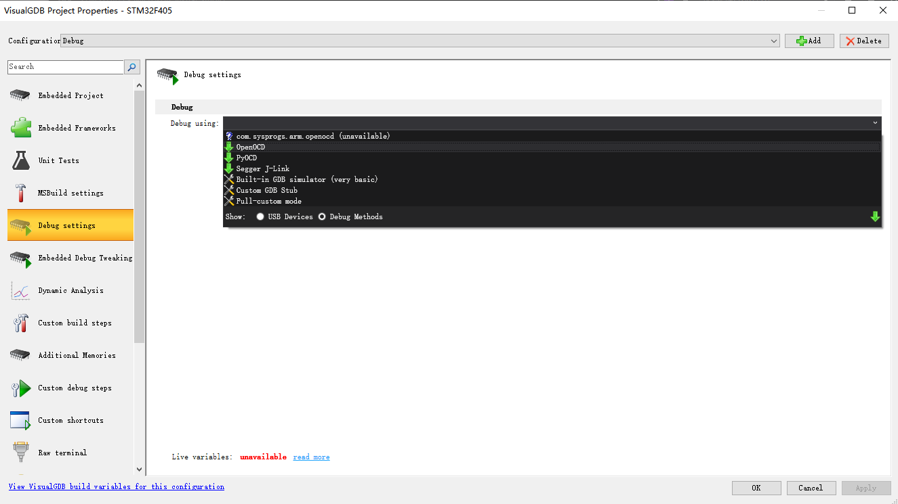

    下载完毕后，在SWD programmer内选择ST-Link v2：（v2还是其它需视情况而定）

    

    点击Debug using后面的Test，如果看到如下提示，说明一切正常。

    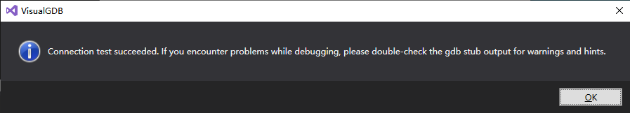

    回到项目中，按Ctrl+F5即可烧录程序。

---

若按上述操作无果，需要手动选择STN32 Devices 下载。

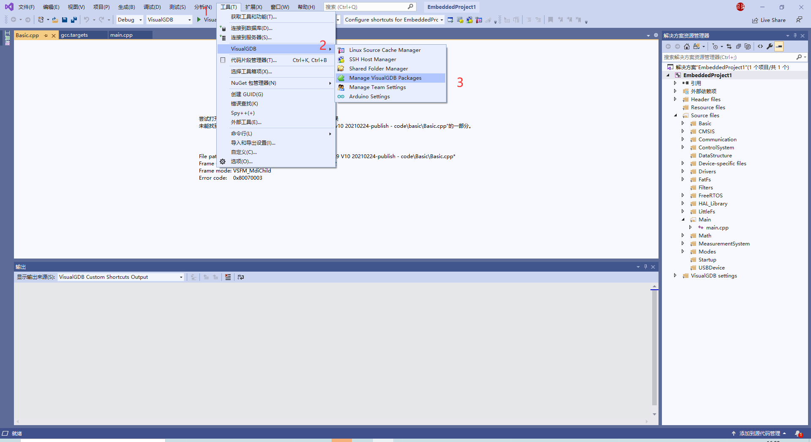

---

# VisualGDB的优点

VisualGDB提供了强大的调试功能，并且可以利用Visual Studio原本的Intellisense等代码编辑工具，最有价值的是使用Live Variables实时观察变量，并且可以观察数据曲线：

​     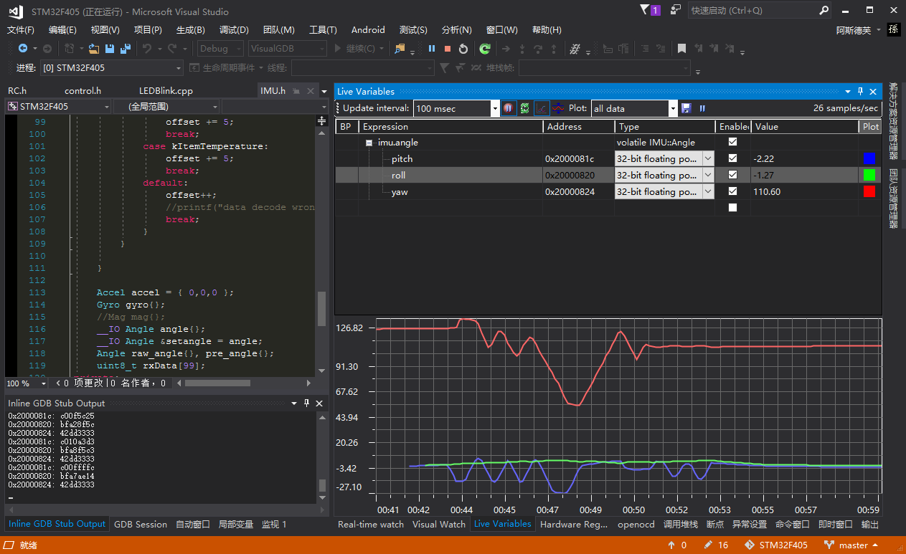

另外一个是调用堆栈。当程序进入错误中断时最有用，通过观察堆栈信息即可找到直接导致错误的位置，这是目前Keil无法取代的功能。

***

祝大家操作顺利！

如果安装过程中出现其他问题，请自行进行上网搜索，解决方案需要一点点摸索出来！顺便写进我们RCS经验库中
